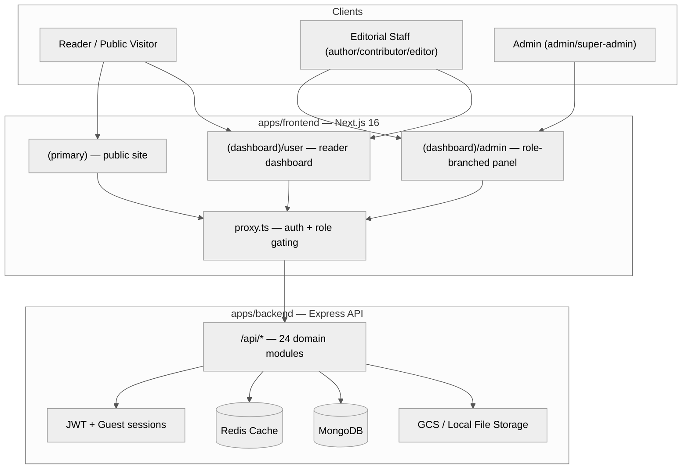
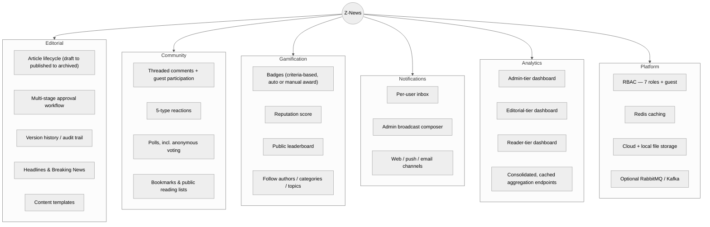
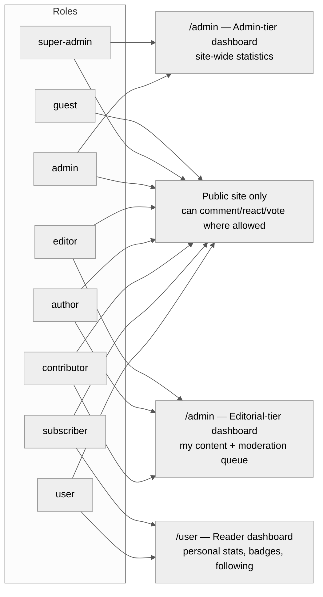

<div align="center">

# Z-News

**A full-stack, role-aware news publishing platform** — editorial workflow, real-time community engagement, gamification, and role-based analytics dashboards, delivered as one pnpm monorepo.

[Backend README](apps/backend/README.md) · [Frontend README](apps/frontend/README.md)

</div>

---

## What This Is

Z-News is an end-to-end news portal: a public reading experience, a multi-stage editorial workflow for producing content, and role-based admin/reader dashboards for everyone from a `super-admin` down to an anonymous `guest`. Three roles use the system very differently, and the platform is built around that distinction rather than papering over it:

- **Readers** browse, react, comment, bookmark, vote in polls, and track their own reputation/badges/reading lists on a personal dashboard.
- **Editorial staff** (`author`/`contributor`/`editor`) write, review, and publish through a multi-stage approval workflow, with a dashboard tailored to _their own_ content and moderation queue.
- **Admins** (`admin`/`super-admin`) manage the whole platform — users, taxonomy, moderation, gamification, notifications — from a site-wide analytics dashboard.

Every one of those experiences is served by the same Next.js app and the same Express API, gated by role rather than split into separate deployments.

---

## Repository Structure

```text
z-news/
├── apps/
│   ├── frontend/     # Next.js 16 — public site + admin panel + reader dashboard
│   └── backend/      # Express + MongoDB — REST API, 24 domain modules
├── infra/            # Docker, nginx, and monitoring config for apps/backend
└── pnpm-workspace.yaml
```

Each app was originally a separate repository (frontend, backend, and a standalone admin panel) and was merged into this monorepo with full commit history preserved — `git log -- apps/backend` etc. shows the merge commit; `git log <merge-commit>^2` reaches the pre-merge history. The standalone admin panel no longer exists as a separate app: every page, the shared UI kit, auth, and the data layer were ported into `apps/frontend`'s `(dashboard)/admin` route group.

---

## System Architecture

<div align="center">



</div>

**Frontend** — one Next.js app, three experiences gated by route group and role (see the [frontend README](apps/frontend/README.md) for the full route/role matrix).
**Backend** — one Express API, 24 domain modules behind a consistent REST convention (list/detail/create/update/soft-delete/permanent-delete/restore), see the [backend README](apps/backend/README.md) for the complete module and endpoint breakdown.

---

## Platform Capabilities at a Glance

<div align="center">



</div>

---

## Role-Based Experience

<div align="center">



</div>

This is enforced end-to-end, not just visually: the frontend's `proxy.ts` middleware derives required roles per admin route from the sidebar menu tree, and the backend's `auth()` middleware independently re-checks the same role list on every request — the UI never being the only gate.

---

## Tech Stack Overview

| Layer        | Stack                                                                                                                                          |
| :----------- | :--------------------------------------------------------------------------------------------------------------------------------------------- |
| **Frontend** | Next.js 16 (App Router, Turbopack) · React 19 · TypeScript · Tailwind CSS 4 · `@tanstack/react-query` · `react-hook-form` + `zod` · `recharts` |
| **Backend**  | Express 5 · TypeScript · MongoDB + Mongoose 8 · Redis · Socket.io · Zod                                                                        |
| **Auth**     | JWT access/refresh rotation, httpOnly refresh cookie, Google OAuth, guest sessions                                                             |
| **Infra**    | Docker (dev/full/prod stacks), nginx, Prometheus/Grafana monitoring, optional RabbitMQ/Kafka                                                   |
| **Testing**  | Jest — 49 suites / 408 tests (backend)                                                                                                         |

Full per-app breakdowns (dependencies, directory maps, ER diagrams, sequence diagrams) live in each app's own README — this document is the project-level map, not a duplicate of either.

---

## Getting Started

```bash
pnpm install

# Run each app's own dev server
pnpm dev:frontend
pnpm dev:backend
```

### Backend infrastructure (Docker)

```bash
cd apps/backend
pnpm docker:dev        # lightweight dev stack: app + redis (+ mongo-express/mailhog)
pnpm docker:dev:full    # full dev stack: + kafka + rabbitmq + prometheus/grafana
pnpm docker:prod        # production stack (resource limits, healthcheck, optional nginx)
```

See `infra/docker/`, `infra/nginx/`, and `infra/monitoring/` for the underlying configuration.

### Linting the whole workspace

```bash
pnpm lint       # runs each app's own lint script
pnpm lint:fix
```

---

## Documentation Map

| Document                                              | Covers                                                                                                                             |
| :----------------------------------------------------- | :------------------------------------------------------------------------------------------------------------------------------- |
| [`apps/backend/README.md`](apps/backend/README.md)     | Every domain module, security posture, full ER diagram, API endpoint reference, workflow sequence diagrams, production checklist |
| [`apps/frontend/README.md`](apps/frontend/README.md)   | Route/role architecture, dual API client design, auth flow, full page routing matrix, directory map                              |

---

## License

Proprietary and Confidential. Unauthorized duplication or distribution is strictly prohibited.
