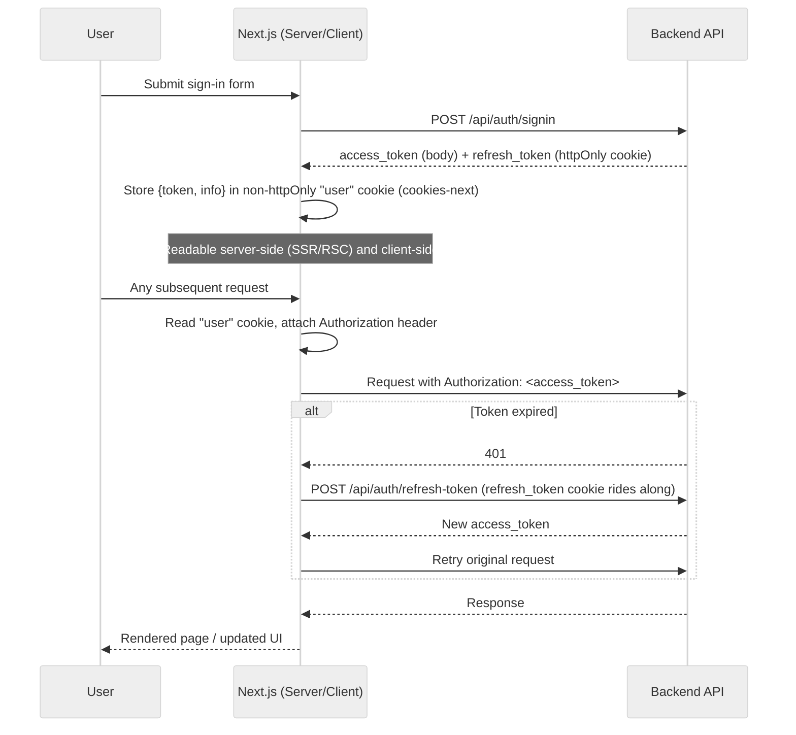
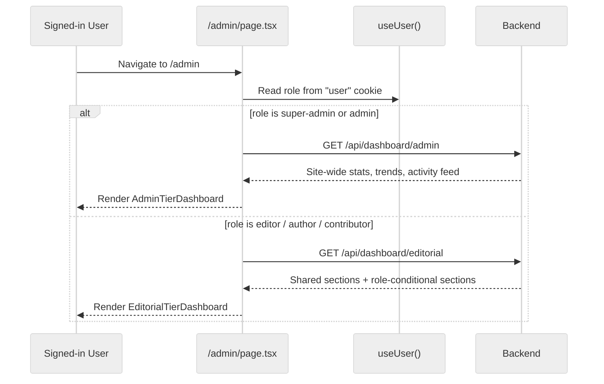
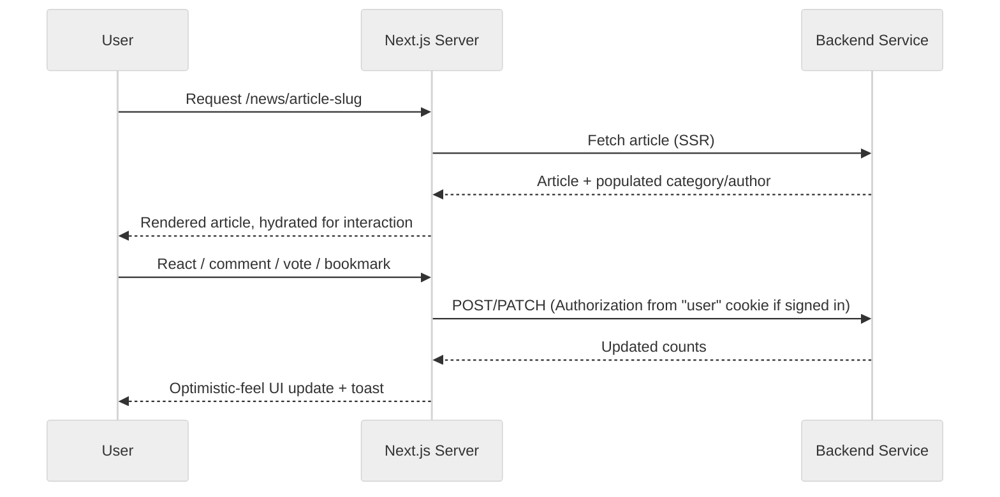

# Z-News Frontend

A unified Next.js application serving the full Z-News ecosystem: the public news portal, a role-aware admin panel, and a personal reader dashboard — all in one deployable app, sharing one design system, one auth model, and one API client layer.

---

## Table of Contents

- [Core Modules and Features](#core-modules-and-features)
  - [Public Site](#public-site)
  - [Admin Panel](#admin-panel)
  - [Reader Dashboard](#reader-dashboard)
  - [Cross-Cutting Concerns](#cross-cutting-concerns)
- [Tech Stack](#tech-stack)
- [Architecture](#architecture)
  - [Route Groups and Access Control](#route-groups-and-access-control)
  - [Authentication Flow](#authentication-flow)
  - [Dual API Client Architecture](#dual-api-client-architecture)
- [Project Directory Map](#project-directory-map)
- [Page Routing Matrix](#page-routing-matrix)
- [Data Orchestration](#data-orchestration)
- [Workflow Diagrams](#workflow-diagrams)
- [Development and Deployment](#development-and-deployment)
- [License](#license)

---

## Core Modules and Features

### Public Site

Everything under `(primary)` — the reader-facing news portal, server-rendered where it matters for SEO.

- **Editorial Consumption**: Home page with segmented Headlines/Breaking/Featured sections, article detail pages with rich HTML content, hierarchical category browsing, event-tagged feeds, and global search.
- **Engagement**: Multi-type reactions (like/dislike/insightful/funny/disagree), threaded comments with guest participation, bookmarking, native share + print, and per-article poll voting widgets (guest voting supported where the poll allows it).
- **Gamification, surfaced publicly**: A `/leaderboard` ranking users by reputation, public reading-list browsing, public user profile pages showing badges and follow counts.
- **Auth pages** (`app/auth/`): sign-in/sign-up (with Google OAuth), forgot/reset password, email verification — all sharing one auth layout.
- **Notifications**: a public `/notification` page and a header bell with live unread counts, backed by the same per-user inbox the admin and user dashboards use.

### Admin Panel

Everything under `(dashboard)/admin` — role-gated by `proxy.ts`, with per-route required roles derived from `admin-menu-items.ts`.

- **Role-Aware Dashboard**: `/admin` renders one of two dashboards depending on the signed-in role — an **Admin tier** (super-admin/admin: site-wide statistics, view/user-growth trend charts, category breakdown, upcoming events, a real recent-activity feed) or an **Editorial tier** (editor/author/contributor: shared category/activity context plus conditional "My Content Performance" and "Moderation Queue" sections), both backed by the backend's consolidated `dashboard` module.
- **Editorial Management**: full News Article CRUD with a multi-section form (content editor, categories/tags, publish settings, template selector, poll attachment), an editorial Kanban workflow board, and per-article version history. Lighter-weight CRUD for News Headlines and News Break.
- **Taxonomy & Assets**: Categories (with hierarchy), Events, Files, and a curated Media library layered on top of Files.
- **Community Moderation**: Users, Comments (status filters plus a dedicated flagged-report queue and an edit-history viewer), Reactions.
- **Gamification Admin**: Badge management (create/edit/delete/seed criteria-based badges).
- **Notifications**: the existing self-inbox view, plus a broadcast composer that targets an audience by role or specific users.
- **Recycle Bin**: soft-delete restore/permanent-delete across users, categories, news, comments, events, and files.
- **Content Templates**: reusable article templates injectable into the article editor.

### Reader Dashboard

Everything under `(dashboard)/user` — open to any signed-in role (not just readers; every role has a personal account area here too), gated by `proxy.ts` for authentication only, no role restriction.

- **Overview**: unread notifications, bookmark count, and reputation score at a glance, plus an engagement-over-time chart, badge progress bars, a following summary, and upcoming events — all from one consolidated dashboard query.
- **Bookmarks & Reading Lists**: save articles, organize them into named public/private reading lists, follow other users' public lists.
- **Following**: manage followed authors, categories, and topics.
- **Profile & Settings**: edit bio/location/website/social links, and per-channel/per-category notification preferences.

### Cross-Cutting Concerns

- **Theming**: light/dark/system theme, LTR/RTL direction, and language, all persisted in a single `preference` cookie and applied before first paint via a blocking inline script in the root layout — no flash of unstyled content, and no loss of static-site generation (the script reads `document.cookie` client-side rather than calling `cookies()` server-side, which would force the whole site dynamic).
- **Responsive, accessible UI kit**: ~21 flattened (non-compound) primitives under `components/ui/` — Modal, DataTable, FormControl, Chart (recharts wrapper), Card, Badge, Switch, and more — reused identically across the public site, admin panel, and reader dashboard.

---

## Tech Stack

| Category              | Technology                                                      |
| :--------------------- | :--------------------------------------------------------------- |
| Framework              | Next.js 16 (App Router — SSR/SSG/ISR, Turbopack)                 |
| Render Engine           | React 19                                                          |
| Language                | TypeScript (strict)                                               |
| Styling                 | Tailwind CSS 4                                                    |
| Server State            | `@tanstack/react-query` — one shared `QueryClient` for the whole app |
| Forms & Validation      | `react-hook-form` + `zod`                                        |
| Charts                  | `recharts`, via a shared `Chart` wrapper component                |
| HTTP Clients            | Custom `Fetch` wrapper class (`lib/api.ts`, public/reader-facing services) **and** an `axios` instance with refresh-token interceptors (`lib/admin-api.ts`, admin-only services) |
| Auth/Settings Persistence | `cookies-next` — isomorphic cookie read/write, works in both Server and Client Components |
| Icons                   | `lucide-react`                                                    |
| Rich Text               | BlockNote-based editor (client-only, dynamically imported)        |
| Notifications (UI)      | `react-toastify`                                                  |

> **Note on `redux`/`@reduxjs/toolkit`**: still present in `package.json` and `src/redux/` from before this app's cookie/react-query migration, but no longer wired into the app (`AppProviders` does not mount a Redux `Provider`) — all server state now flows through react-query, and all persisted client state (auth, theme/settings) through cookies. Treat it as legacy, not part of the current architecture.

---

## Architecture

### Route Groups and Access Control

<div align="center">

```mermaid
%%{init: {'theme': 'neutral', 'themeVariables': {'primaryColor': '#ffffff', 'primaryBorderColor': '#333333', 'primaryTextColor': '#111111', 'lineColor': '#555555', 'secondaryColor': '#f5f5f5', 'tertiaryColor': '#e5e5e5'}}}%%
graph TB
    Visitor[Any Visitor] --> Primary["(primary) — public site"]
    Visitor --> AuthPages["auth/ — sign-in, sign-up, password reset"]

    SignedIn[Signed-In User, any role] --> UserDash["(dashboard)/user — Reader tier"]

    AdminRoles["super-admin / admin / editor / author / contributor"] --> AdminDash["(dashboard)/admin — role-branched dashboard"]

    Proxy[proxy.ts middleware] -.enforces.-> UserDash
    Proxy -.enforces per-route roles from admin-menu-items.ts.-> AdminDash

    subgraph "Shared across all three"
        API[Dual API client layer]
        UI[UI kit + Chart wrapper]
        Cookies["user / preference cookies"]
    end

    Primary --> API
    UserDash --> API
    AdminDash --> API
```

</div>

`proxy.ts` (the Next 16 middleware convention) protects both `/admin/*` and `/user/*`: unauthenticated visitors are redirected to sign-in on either; `/admin/*` additionally derives the required role(s) per exact route by walking `admin-menu-items.ts`'s tree, so a role only sees — and can only reach — the sections its menu entry grants it.

### Authentication Flow

<div align="center">



</div>

### Dual API Client Architecture

Two HTTP clients exist deliberately, matching two different sets of consumers:

- **`lib/api.ts`** — a small custom `Fetch` wrapper with a request interceptor that reads the `user` cookie (via `cookies-next`'s isomorphic `getCookie`, working identically in Server Components and Client Components) and attaches `Authorization` when present. Used by every public-site and reader-dashboard service (`news.service.ts`, `bookmark.service.ts`, `poll.service.ts`, `dashboard.service.ts`'s reader endpoint, etc.) — these need to work for both signed-in and anonymous requests, and often run server-side for SSR.
- **`lib/admin-api.ts`** — an `axios` instance with request/response interceptors handling the same cookie-based token attachment plus automatic refresh-token retry-queueing on 401. Used by every `admin-*.service.ts` file (all `/admin` pages, including the admin/editorial dashboard endpoints) — these are always CSR, always require a real signed-in admin-ish role, and benefit from axios's richer interceptor chain for the refresh flow.

---

## Project Directory Map

```text
src/
├── app/                       # Next.js 16 App Router
│   ├── (primary)/            # Public site: home, news, category, event, search, leaderboard, notification, profile, reading-lists, about, contact
│   ├── (dashboard)/
│   │   ├── admin/            # Admin panel — role-branched dashboard + ~16 management sections, each with its own _components/
│   │   └── user/             # Reader dashboard — overview, bookmarks, reading-lists, following, profile, settings, notifications
│   ├── auth/                 # Sign-in/up, forgot/reset password, email verification
│   ├── layout.tsx            # Root layout: fonts, FOUC-prevention script, AppProviders
│   └── proxy.ts               # Route protection (auth + per-role gating)
├── components/
│   ├── (common)/              # Page-specific feature components (news-page action bar, comment section, etc.)
│   ├── (auth)/                # Auth page forms
│   ├── partials/
│   │   ├── admin/             # Admin shell: Sidebar, Header, StatisticCard, PageHeader, form primitives
│   │   ├── user/               # Reader-dashboard shell: Sidebar, Header (mirrors admin's, minus role-gating)
│   │   └── Header/, Footer/    # Public-site chrome
│   ├── ui/                    # ~21 flattened UI primitives (Modal, DataTable, Chart, FormControl, Card, Badge, Switch, ...)
│   ├── cards/                 # News card variants (grid/list/overlap)
│   └── skeletons/              # Loading states
├── services/                  # 31 files — one per backend module/consumer split (admin-*.service.ts vs public *.service.ts)
├── types/                     # One *.type.ts per service, mirroring backend response shapes
├── data/                      # admin-menu-items.ts, user-menu-items.ts (role-gated sidebar trees)
├── builder/                   # RouteMenu — turns a menu-items tree + role into a rendered menu/breadcrumb map
├── hooks/
│   ├── states/                 # useUser (auth cookie), usePreference (settings cookie)
│   ├── ui/                     # useSidebar, useAlert, useScreenSize, ...
│   └── observers/               # Intersection/mutation observer hooks
├── lib/                        # api.ts (Fetch client), admin-api.ts (axios client), utils.ts
├── providers/                   # AppProviders (QueryClientProvider, GoogleOAuthProvider, ToastContainer)
├── config/                      # Env, SEO, endpoint constants
└── redux/                       # Legacy, unused — see Tech Stack note above
```

---

## Page Routing Matrix

| Area | Route | Notes |
| :--- | :--- | :--- |
| Public | `/` | Headlines, breaking news, featured sections |
| Public | `/news/[slug]` | Article detail — reactions, comments, share/print, bookmark, poll widget |
| Public | `/category/[slug]`, `/event/[slug]` | Taxonomy-filtered feeds |
| Public | `/search` | Query-based discovery |
| Public | `/leaderboard`, `/reading-lists`, `/notification`, `/profile/[userId]` | Gamification, public reading lists, notification inbox, public profile |
| Auth | `/auth/sign-in`, `/sign-up`, `/forgot-password`, `/reset-password`, `/verify-email` | Shared auth layout |
| Admin | `/admin` | Role-branched dashboard (Admin tier / Editorial tier) |
| Admin | `/admin/news-articles`, `/news-headline`, `/news-break`, `/categories`, `/events`, `/files`, `/media`, `/users`, `/comments`, `/reactions`, `/badges`, `/content-templates`, `/notifications`, `/notifications-broadcast`, `/bin` | Management sections, role-gated per `admin-menu-items.ts` |
| Reader | `/user` | Personal dashboard overview |
| Reader | `/user/bookmarks`, `/reading-lists[/id]`, `/following`, `/profile`, `/settings`, `/notifications` | Personal account area, open to every signed-in role |

---

## Data Orchestration

- **Server state**: every list/detail/mutation goes through `@tanstack/react-query`'s `useQuery`/`useMutation`, with one shared `QueryClient` from `AppProviders` — admin pages must reuse this client rather than instantiate their own.
- **Forms**: `react-hook-form` + `zod` resolvers throughout, matching one consistent validation-and-error-display pattern across the article editor, every admin CRUD modal, and the public-site auth/profile forms.
- **Confirmation flows**: destructive actions (delete, permanent-delete) go through a shared `useAlert()` confirm dialog rather than the browser's native `confirm()`.
- **Real-time-ish updates**: no websockets on the frontend yet — the notification bells (public, admin, and reader-dashboard) poll every 30 seconds via react-query's `refetchInterval`, sharing one `useUnreadNotificationCount` hook.

---

## Workflow Diagrams

### Admin Dashboard Load (Role-Branch)

<div align="center">



</div>

### Article Detail: Data + Engagement

<div align="center">



</div>

---

## Development and Deployment

### Environment Setup

1. **Dependencies**:
   ```bash
   pnpm install
   ```

2. **Configuration** — populate `.env.local`:
   ```bash
   NEXT_PUBLIC_APP_URL=http://localhost:3000
   NEXT_PUBLIC_API_URL=http://localhost:5000
   NEXT_PUBLIC_GOOGLE_CLIENT_ID=...
   ```

3. **Local Execution**:
   ```bash
   pnpm dev
   ```

### Production

1. **Build**:
   ```bash
   pnpm build
   ```
2. **Verify**: `pnpm lint` (ESLint, flat config), `tsc --noEmit` for type-checking.
3. **Hosting**: Vercel-ready out of the box; also runs as a standard Node.js server (`next start`) behind any reverse proxy.

---

## License

Proprietary and Confidential. Unauthorized distribution or modification is strictly prohibited.
